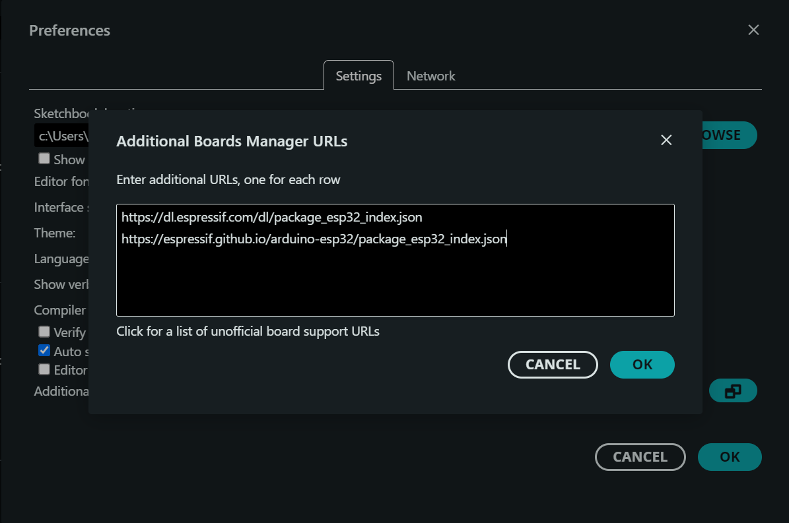

What ESP32 board did you buy?

I got the ESP-WROOM-32 ESP32 ESP-32S Development Board 2.4GHz Dual-Mode WiFi + Bluetooth Dual Cores Microcontroller Processor Integrated with Antenna RF AMP Filter AP STA Compatible with Arduino IDE

In arduino IDE, open File > additional boards manager URLs:

Copy and paste these URLs in the text box and click ok

`https://dl.espressif.com/dl/package_esp32_index.json`
`https://espressif.github.io/arduino-esp32/package_esp32_index.json`

Download UART drivers from this website ; [Serial UART Drivers](https://www.silabs.com/software-and-tools/usb-to-uart-bridge-vcp-drivers?tab=overview)

Compile the sample code i've included below.
Select the COM port that looks like its connected to the ESP32

Run this sample code and see the output.
* * *
// ESP32 Test Sketch
const int ledPin = 2; // Onboard LED is typically on GPIO 2

void setup() {
  Serial.begin(115200); // Initialize serial communication
  pinMode(ledPin, OUTPUT);
  Serial.println("ESP32 Test Initialized");
}

void loop() {
  digitalWrite(ledPin, HIGH);
  Serial.println("KYAMISANA");
  delay(500);

  digitalWrite(ledPin, LOW);
  Serial.println("KYAGGULO");
  delay(500);
}
* * *
The blue light should blink. Also, this action should trigger output on the serial monitor
 